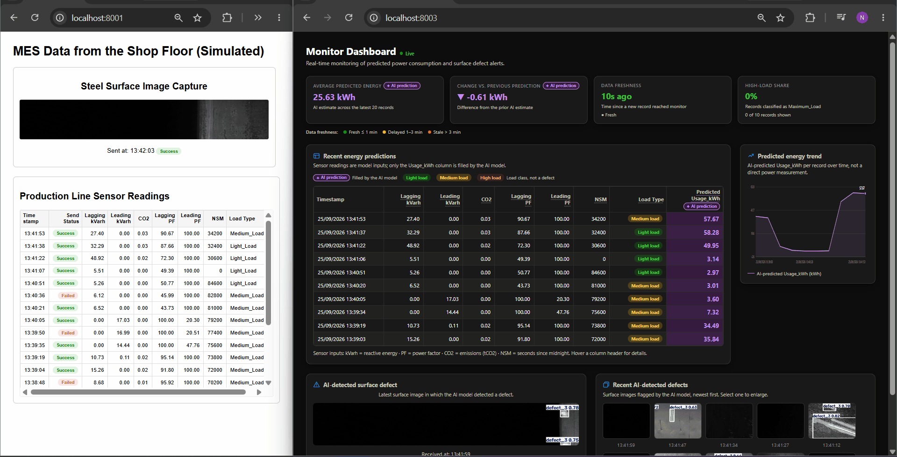

# mes_mt

A proof-of-concept monitoring system for a steel production line. It is made
of 3 **independent** FastAPI apps. Each app runs on its own port, and they
talk to each other over HTTP as a pipeline: `prod_line` → `asst` → `monitor`.

The system runs two pipelines side by side:

- **Surface defect detection**: camera images are checked by a YOLO model, and
  only images with a detected defect reach the monitor.
- **Energy usage prediction**: sensor records are sent without `Usage_kWh`, an
  XGBoost model predicts it, and the monitor shows and logs the result.

```
prod_line/data/from_camera/  --(random)-->  prod_line  --POST /api/image-->   asst  --POST /api/image-->   monitor
prod_line/data/tabular/*.csv --(next row)-> prod_line  --POST /api/record-->  asst  --POST /api/record-->  monitor
                                                                               |                            |
                                                                  asst/data/img_in/  (temporary)   monitor/data/img/ (max 10 images)
                                                                  asst/data/img_out/ (on detection) monitor/data/tabular/records_history.csv
```



## Project structure

```
mes_mt/
├── .github/
│   ├── ISSUE_TEMPLATE/
│   │   ├── bug_report.md
│   │   ├── feature_request.md
│   │   └── spike_investigation.md
│   └── workflows/
│       └── ci.yml                      # runs the tests on every PR to main
├── docs/
│   ├── BUSINESS_REQUIREMENTS.md
│   ├── CODING_RULES.md
│   ├── DOMAIN_MODEL.md
│   ├── SPEC_SYSTEM_OVERVIEW.md
│   └── api-spec.md
├── prod_line/                          # line simulator, port 8001
│   ├── data/
│   │   ├── from_camera/                # source images (from test_images.zip)
│   │   └── tabular/
│   │       └── Steel_industry_data.csv # source sensor records
│   ├── docs/
│   │   └── SPEC_PROD_LINE.md
│   ├── routers/
│   │   ├── api.py
│   │   └── dashboard.py
│   ├── services/
│   │   ├── image_service.py
│   │   └── record_service.py
│   ├── static/
│   │   ├── dashboard.js
│   │   └── style.css
│   ├── templates/
│   │   └── index.html
│   ├── config.py
│   ├── main.py
│   ├── producer.py
│   ├── record_producer.py
│   ├── record_state.py
│   └── state.py
├── asst/                               # AI worker, port 8002
│   ├── data/
│   │   ├── img_in/                     # temporary input images
│   │   ├── img_out/                    # annotated images with a defect
│   │   ├── model/
│   │   │   └── analyst_model.pkl       # trained Usage_kWh model
│   │   └── train/
│   │       └── Steel_industry_data.csv # training data
│   ├── docs/
│   │   └── SPEC_ASST.md
│   ├── routers/
│   │   └── api.py
│   ├── services/
│   │   ├── analyst_service.py
│   │   ├── image_service.py
│   │   └── yolo_service.py
│   ├── config.py
│   └── main.py
├── monitor/                            # dashboard, port 8003
│   ├── data/
│   │   ├── img/                        # the 10 newest defect images
│   │   └── tabular/                    # records_history.csv
│   ├── docs/
│   │   └── SPEC_MONITOR.md
│   ├── routers/
│   │   ├── api.py
│   │   └── dashboard.py
│   ├── services/
│   │   ├── history_service.py
│   │   ├── record_csv_service.py
│   │   └── record_service.py
│   ├── static/
│   │   ├── dashboard.js
│   │   └── style.css
│   ├── templates/
│   │   └── dashboard.html
│   ├── config.py
│   └── main.py
├── tests/
│   ├── conftest.py
│   ├── prod_line/                      # test_image_service.py, test_producer.py,
│   │                                   # test_record_producer.py, test_record_service.py,
│   │                                   # test_routes.py, test_state.py
│   ├── asst/                           # conftest.py, test_analyst_service.py,
│   │                                   # test_image_service.py, test_routes.py,
│   │                                   # test_yolo_service.py
│   └── monitor/                        # test_history_service.py, test_record_csv_service.py,
│                                       # test_record_service.py, test_routes.py
├── logs/                               # created at runtime, one log file per service
├── demo.gif
├── pytest.ini
├── requirements.txt
├── requirements-dev.txt
└── README.md
```

Empty `data/` folders hold a `.placeholder` file so that Git keeps them. The
services only read files with the expected extension, so the placeholder is
never picked up as data.

## Services

### `prod_line/`: line simulator, port `8001`

Simulates the camera and the sensors of the line with two background loops:

- **Images**: every `interval_seconds` (default 3 s), picks a random image
  from `prod_line/data/from_camera/` and sends it to `asst` at `POST /api/image`.
- **Records**: every `record_interval_seconds` (default 15 s), reads the next
  row of `prod_line/data/tabular/Steel_industry_data.csv`, sets `date` to the
  current time and `Usage_kWh` to `null`, and sends it to `asst` at
  `POST /api/record`. Reading starts at a random row and moves forward
  `record_skip` rows (default 2) each time.

To simulate an overloaded network, each send can be dropped on purpose
(`image_send_failure_rate` = 10%, `record_send_failure_rate` = 20%). Every
image and record is still shown on the page, marked **Success** or **Failed**.

The page `GET /` shows the last image with its send time and status, and a
grid of the last 20 records. Loading the page also restarts record reading
from a new random row.

- `prod_line/producer.py`: image loop.
- `prod_line/record_producer.py`: record loop.
- `prod_line/state.py`: last image sent (in memory).
- `prod_line/record_state.py`: last 20 records (in memory).
- `prod_line/services/image_service.py`: picks a random image file.
- `prod_line/services/record_service.py`: walks through the CSV.
- `prod_line/routers/`: `GET /`, `GET /api/image/latest`, `GET /api/image/meta`, `GET /api/records`.
- `prod_line/config.py`: settings.

### `asst/`: AI worker, port `8002`

No web page. It loads the YOLO model from Hugging Face Hub at startup.

`POST /api/image` saves the image temporarily to `asst/data/img_in/` and runs
YOLO on it (confidence ≥ 0.6):

- **No defect detected**: logs the result and deletes the temporary file.
  Nothing is saved and nothing is sent to `monitor`.
- **Defect detected**: saves the annotated image to `asst/data/img_out/` (the
  file name gets the processing time `HHMMSS` appended), deletes the original
  temporary file, and sends the annotated image to `monitor`. Once the send
  succeeds, the annotated file is deleted too.

`POST /api/record` predicts `Usage_kWh` with the model in
`asst/data/model/analyst_model.pkl`, fills it into the record, and sends the
record to `monitor`.

`GET /api/train` retrains that model from
`asst/data/train/Steel_industry_data.csv` and returns its MSE and R².

- `asst/routers/api.py`: the 3 endpoints above.
- `asst/services/image_service.py`: bytes ⇄ image conversion, file saving.
- `asst/services/yolo_service.py`: loads YOLO and runs detection; `predict()`
  returns `(None, [])` when nothing is found, or
  `(annotated_image, [class_name, ...])` otherwise.
- `asst/services/analyst_service.py`: trains and runs the `Usage_kWh` model.
- `asst/config.py`: settings.

### `monitor/`: dashboard, port `8003`

- `POST /api/image` stores the image from `asst` in `monitor/data/img/` and
  keeps only the **10 newest** images (older ones are deleted).
- `POST /api/record` adds the record to an in-memory list of the last 20
  records and appends it to `monitor/data/tabular/records_history.csv`, which
  keeps every record permanently.

The page `GET /` refreshes every 2 seconds and shows:

- 4 indicators: average predicted usage, trend compared to the previous
  record, time since the last new record, and the share of records at
  `Maximum_Load`.
- A grid and a line chart of the predicted `Usage_kWh`.
- The latest defect image and an album of the stored images (click to enlarge).

- `monitor/routers/`: `GET /`, `POST /api/image`, `GET /api/image/latest`,
  `GET /api/image/meta`, `GET /api/hist`, `GET /api/hist/{filename}`,
  `POST /api/record`, `GET /api/records`.
- `monitor/services/history_service.py`: image archive with the 10-image limit.
- `monitor/services/record_service.py`: last 20 records (in memory).
- `monitor/services/record_csv_service.py`: permanent CSV history.
- `monitor/templates/`, `monitor/static/`: dashboard HTML, JS and CSS.
- `monitor/config.py`: settings.

## Installation and running

```bash
pip install -r requirements.txt
```

### Sample images

The sample steel surface images come packed in
`prod_line/data/from_camera/test_images.zip` (about 430 MB, 5,506 `.jpg`
files). Before starting, extract it **in that same folder** and then delete the
zip file. The images sit at the top level of the archive, so they land
directly in `prod_line/data/from_camera/`.

Linux / macOS / Git Bash:

```bash
unzip prod_line/data/from_camera/test_images.zip -d prod_line/data/from_camera/
```

```bash
rm prod_line/data/from_camera/test_images.zip
```

Windows PowerShell:

```powershell
Expand-Archive -Path prod_line/data/from_camera/test_images.zip -DestinationPath prod_line/data/from_camera/
```

```powershell
Remove-Item prod_line/data/from_camera/test_images.zip
```

Afterwards `prod_line/data/from_camera/` should contain only `.jpg` files. You
can also add your own `.jpg`, `.jpeg`, `.png` or `.bmp` images there. Extracted
images are not tracked by Git (`*.jpg` is ignored).

### Running

Open 3 terminals and start one service in each. The order does not matter:
while a downstream service is not up yet, sends to it are marked **Failed**
and the next tick simply tries again.

```bash
uvicorn monitor.main:app --port 8003
```

```bash
uvicorn asst.main:app --port 8002
```

```bash
uvicorn prod_line.main:app --port 8001
```

The first start of `asst` needs internet access to download the YOLO model
from Hugging Face Hub; it is cached afterwards.

A trained energy model is already included in the repository. To retrain it
(for example after changing the training CSV):

```bash
curl http://localhost:8002/api/train
```

Then open:

- http://localhost:8001/: what `prod_line` is sending, and whether each send succeeded.
- http://localhost:8003/: the `monitor` dashboard (energy predictions, latest defect, album).

**Note:** all paths (`*/data/...`, `logs/...`) are relative, so `uvicorn`
must be started from the project root.

**Note:** on Windows 11, if pandas or numpy fails to load, you may need to
turn off Smart App Control (SAC). This is not a bug in the project.

## Tests

```bash
pip install -r requirements-dev.txt
```

```bash
python -m pytest -q
```

The unit tests in `tests/` do not start the services, download the YOLO
model, or make network calls. The GitHub Actions workflow
(`.github/workflows/ci.yml`) runs them on every pull request to `main`.

## Logging

Each app writes its own log file in `logs/` (relative to the directory the
service is started from) and also prints to the console:

- `logs/prod_line.log`: each image and record sent to `asst`, or skipped by a
  simulated failure.
- `logs/asst.log`: each request received, the saved file name and classes
  when a defect is detected, each predicted `Usage_kWh`, and each forward to
  `monitor`.
- `logs/monitor.log`: each image and record received from `asst`.

## Documentation

- `docs/BUSINESS_REQUIREMENTS.md`: business goals and scope.
- `docs/SPEC_SYSTEM_OVERVIEW.md`: architecture and data flow across services.
- `prod_line/docs/SPEC_PROD_LINE.md`, `asst/docs/SPEC_ASST.md`,
  `monitor/docs/SPEC_MONITOR.md`: specification of each service.
- `docs/api-spec.md`: API reference.
- `docs/DOMAIN_MODEL.md`: data objects and classes.
- `docs/CODING_RULES.md`: Python coding rules.
