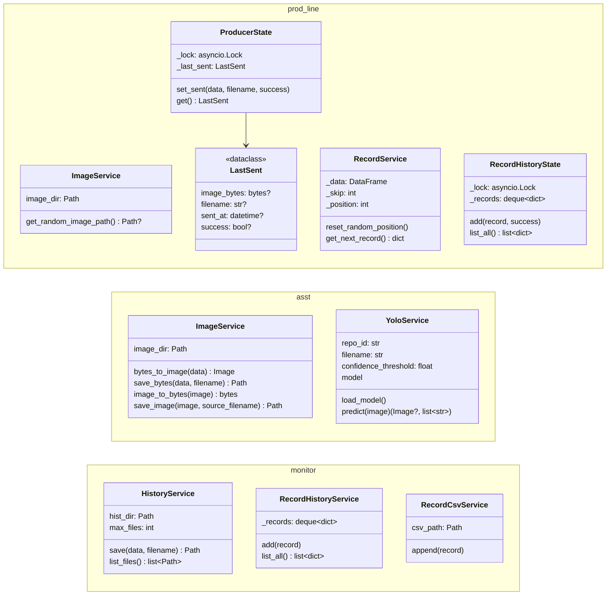

# Domain Model

| | |
|---|---|
| **Project** | `mes_mt` |
| **Version** | 1.1 |
| **Date** | 2026-09-24 |
| **Source** | Written from the current source code of `prod_line/`, `asst/`, `monitor/` |

This document describes the data objects the system works with, the classes that hold them, and how they change as they move `prod_line` → `asst` → `monitor`. The code has no separate domain layer: data is passed as plain `dict`s, image bytes, and files. The classes listed here are the actual classes in the code.

---

## 1. Domain objects

The system handles three kinds of data:

| Object | Represented in code as | Created by | Consumed by |
|---|---|---|---|
| **Image** | raw `bytes` / `PIL.Image` / file on disk | `prod_line` (picked from `data/from_camera`) | `asst` (YOLO), then `monitor` (archive) |
| **Record** (sensor reading) | `dict` with the columns of `Steel_industry_data.csv` | `prod_line` (row from the CSV) | `asst` (predicts `Usage_kWh`), then `monitor` (grid + CSV) |
| **Energy model artifact** | pickled `dict` in `asst/data/model/analyst_model.pkl` | `asst` (`GET /api/train`) | `asst` (`POST /api/record`) |

---

## 2. Record

### 2.1 Fields

The field names are the raw CSV column names and are the same in all three services (`monitor/services/record_csv_service.py` `COLUMNS`).

| Field | Type | Values |
|---|---|---|
| `date` | `str` | `dd/mm/yyyy HH:MM:SS` |
| `Usage_kWh` | `float \| None` | predicted energy usage (kWh) |
| `Lagging_Current_Reactive.Power_kVarh` | `float` | |
| `Leading_Current_Reactive_Power_kVarh` | `float` | |
| `CO2(tCO2)` | `float` | |
| `Lagging_Current_Power_Factor` | `float` | |
| `Leading_Current_Power_Factor` | `float` | |
| `NSM` | `int` | seconds from midnight |
| `WeekStatus` | `str` | `Weekday`, `Weekend` |
| `Day_of_week` | `str` | `Monday` … `Sunday` |
| `Load_Type` | `str` | `Light_Load`, `Medium_Load`, `Maximum_Load` |

### 2.2 How a record changes along the pipeline

| Step | Where | Change to the record |
|---|---|---|
| 1. Read | `prod_line/services/record_service.py` `RecordService.get_next_record` | Row taken from the CSV at the current position; `date` ← now; `Usage_kWh` ← `None`. Position then advances by `record_skip` (wraps around). |
| 2. Send | `prod_line/record_producer.py` `send_record_once` | `POST` to `asst` unless the random roll < `record_send_failure_rate`. An `httpx.HTTPError` also counts as failed. |
| 3. Shown on `prod_line` | `prod_line/record_state.py` `RecordHistoryState.add` | Copy with `added_at` (`HH:MM:SS`) and `send_success` (`bool`) added. Always added, sent or not. |
| 4. Predict | `asst/routers/api.py` `receive_record` → `analyst_service.predict_one` | `Usage_kWh` ← predicted `float`. Other fields unchanged. |
| 5. Forward | `asst/routers/api.py` `receive_record` | Full record `POST`ed to `monitor`. |
| 6. Shown on `monitor` | `monitor/services/record_service.py` `RecordHistoryService.add` | Copy with `received_at` (`HH:MM:SS`) added. |
| 7. Stored | `monitor/services/record_csv_service.py` `RecordCsvService.append` | Row appended to `records_history.csv` with `received_at` (`YYYY-MM-DD HH:MM:SS`). |

The fields `added_at`, `send_success` and `received_at` are local to the service that adds them. `prod_line` does not send `added_at` or `send_success` to `asst`, because it adds them to a copy of the record after the send.

---

## 3. Image

| Step | Where | What happens |
|---|---|---|
| 1. Pick | `prod_line/services/image_service.py` `ImageService.get_random_image_path` | Random file with extension `.jpg .jpeg .png .bmp` from `prod_line/data/from_camera`. No file → the tick is skipped. |
| 2. Send | `prod_line/producer.py` `send_once` | Multipart `POST` (field `file`, original filename) to `asst`, unless the random roll < `image_send_failure_rate`. |
| 3. Shown on `prod_line` | `prod_line/state.py` `ProducerState.set_sent` | Stored as `LastSent(image_bytes, filename, sent_at, success)`. Only the latest one is kept. |
| 4. Detect | `asst/routers/api.py` `receive_image` → `YoloService.predict` | Saved temporarily to `asst/data/img_in`, run through YOLO (`conf=0.6`, `imgsz=1024`), then the temp file is deleted. |
| 5a. No detection | `asst/routers/api.py` | Returns `{"status": "normal", "file": ...}`. Nothing is sent to `monitor`. |
| 5b. Detection | `asst/services/image_service.py` `ImageService.save_image` | Annotated image saved as `<stem>_<HHMMSS><ext>` in `asst/data/img_out`, sent to `monitor`, then deleted. Returns `{"saved_as": ..., "classes": [...]}`. |
| 6. Archive | `monitor/services/history_service.py` `HistoryService.save` | Written to `monitor/data/img/<filename>`. Only the 10 newest files (by modification time) are kept. |

The detected class names are returned in `asst`'s response to `prod_line`. They are not sent to `monitor`, and `prod_line` doesn't use them.

---

## 4. Energy model artifact

Built by `asst/services/analyst_service.py` `train_model` and saved with `pickle` to `analyst_model_path`.

| Key | Type | Content |
|---|---|---|
| `model` | `XGBRegressor` | Trained on 75% of the CSV (`random_state=42`) |
| `feature_columns` | `list[str]` | Feature column order used during training |
| `feature_encoders` | `dict[str, LabelEncoder]` | One encoder per text column (`WeekStatus`, `Day_of_week`, `Load_Type`) |
| `mse` | `float` | Error on the 25% test split |
| `r2` | `float` | R² on the 25% test split |

Feature preparation (`_prepare_features`, shared by training and prediction):

- Renames columns with `COLUMN_RENAMES` (e.g. `CO2(tCO2)` → `CO2`, `Lagging_Current_Power_Factor` → `Lagging_Power_Factor`).
- Drops `date` (`DROPPED_COLUMNS`).
- Label-encodes every text column. During training the encoders are fitted; during prediction the saved encoders are reused.

`predict_one` loads the file from disk on every call. It raises `FileNotFoundError` if the model has not been trained yet, and `ValueError` if a feature column is missing. A text value that wasn't seen during training makes `LabelEncoder.transform` fail.

---

## 5. Classes

`asst/services/analyst_service.py` has no class. It has module functions: `train_model`, `predict`, `predict_one`, plus the helpers `_prepare_features`, `_load_artifact`, `_predict_features`.

Module-level instances:

| Service | Instance | Class |
|---|---|---|
| `prod_line` | `producer_state` | `ProducerState` |
| `prod_line` | `record_history_state` | `RecordHistoryState(max_items=20)` |
| `prod_line` | `image_service` (in `producer.py`) | `ImageService` |
| `prod_line` | `record_service` (in `record_producer.py`) | `RecordService(skip=2)` |
| `asst` | `image_in_service`, `image_out_service` | `ImageService` |
| `asst` | `yolo_service` | `YoloService` (model loaded in `lifespan`) |
| `monitor` | `history_service` | `HistoryService(max_files=10)` |
| `monitor` | `record_history_service` | `RecordHistoryService(max_items=20)` |
| `monitor` | `record_csv_service` | `RecordCsvService` |

---

## 6. Storage and retention

| Data | Service | Storage | Limit | Survives restart |
|---|---|---|---|---|
| Last sent image | `prod_line` | memory (`LastSent`) | 1 | No |
| Sent records | `prod_line` | memory (`deque`) | `record_max_items` = 20 | No |
| Incoming image | `asst` | `asst/data/img_in` | deleted after YOLO | — |
| Annotated image | `asst` | `asst/data/img_out` | deleted after forwarding | — |
| Energy model | `asst` | `asst/data/model/analyst_model.pkl` | 1 (overwritten by training) | Yes |
| Defect images | `monitor` | `monitor/data/img` | `hist_max_files` = 10 | Yes |
| Predicted records | `monitor` | memory (`deque`) | `record_max_items` = 20 | No |
| Predicted records history | `monitor` | `monitor/data/tabular/records_history.csv` | none (append-only) | Yes |

---

## 7. Configured values

| Setting | Service | Default |
|---|---|---|
| `interval_seconds` | `prod_line` | `3.0` |
| `record_interval_seconds` | `prod_line` | `15.0` |
| `image_send_failure_rate` | `prod_line` | `0.1` |
| `record_send_failure_rate` | `prod_line` | `0.2` |
| `record_skip` | `prod_line` | `2` |
| `record_max_items` | `prod_line`, `monitor` | `20` |
| `yolo_confidence_threshold` | `asst` | `0.6` |
| `hist_max_files` | `monitor` | `10` |
